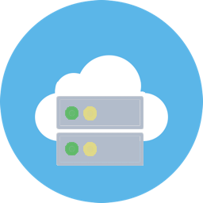
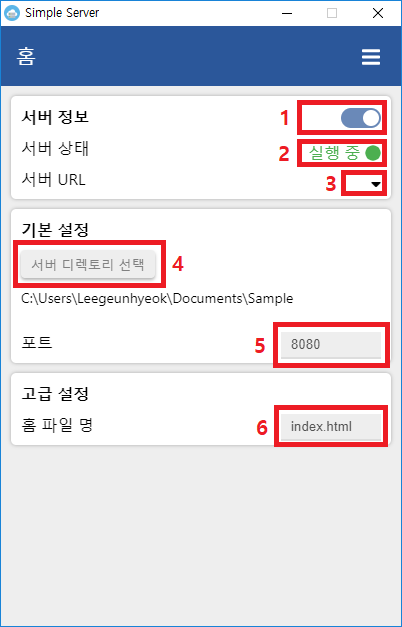

# Simple Server
간단하게 나만의 웹 서버를 시작해보세요!

# 사용법

- ④ 서버 디렉토리 선택 버튼을 눌러 서버 파일(HTML, CSS, 이미지 등..)이 있는 디렉토리를 선택합니다.
- ⑤, ⑥ 항목은 원하는 포트, 파일 명으로 변경 가능합니다.
- ① 스위치를 눌러 서버를 시작합니다.
- 서버가 실행되고 있다면 ③ 영역에 서버 주소가 표시됩니다 (마우스를 올리면 보임) 
- 서버가 정상적으로 실행되는지 상태를 확인하려면 ② 항목을 확인하세요
  - 또한, 상단의 메뉴 버튼을 눌러 서버의 로그 기록을 확인할 수 있습니다.

# 개발 정보
개발자: [Leegeunhyeok](https://github.com/leegeunhyeok)
- Electron
- Vue.js (with Vuex, Vue-router)
- Express.js (Node.js server)

# 아이콘
현재 사용중인 아이콘은 [원본](https://freeiconshop.com/icon/cloud-icon-flat) 이미지를 수정하여 사용 중 입니다.