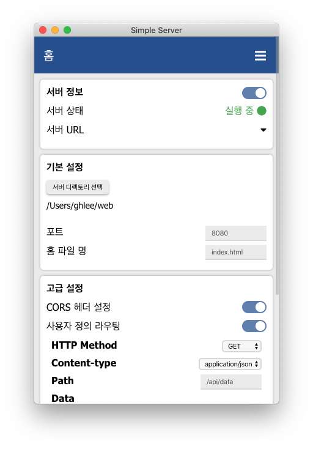
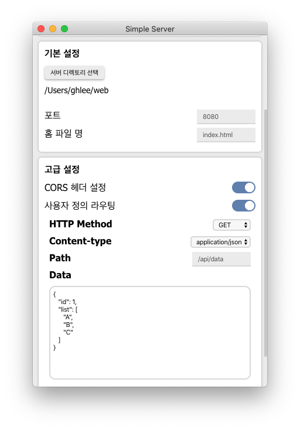
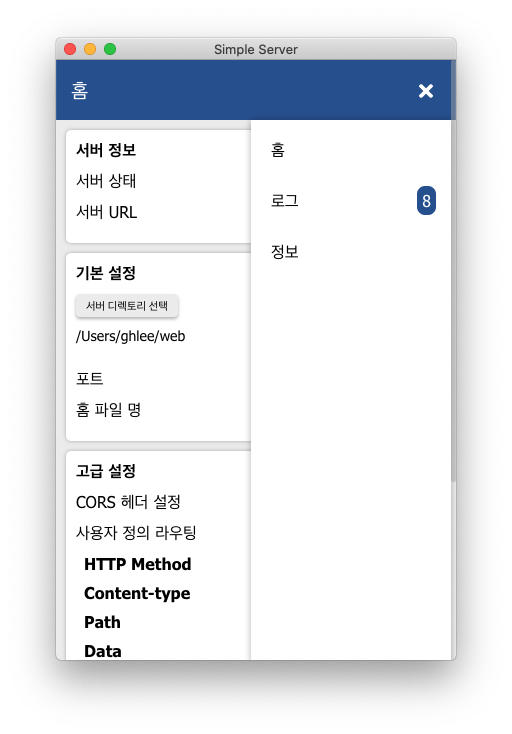

# Simple Server
간단하게 나만의 웹 서버를 시작해보세요!

# 사용법

- 서버 디렉토리 선택 버튼을 눌러 서버 파일(HTML, CSS, 이미지 등..)이 있는 디렉토리를 선택합니다.
- 서버의 포트를 지정할 수 있으며, root 경로에서 표시할 파일명을 설정할 수 있습니다.
- 최상단의 스위치를 눌러 서버를 시작/중지할 수 있습니다.
  - 서버가 실행되고 있다면 `서버 URL`에 마우스를 올려 주소를 확인할 수 있으며, 주소를 클릭하여 웹 페이지를 빠르게 열 수 있습니다.

- 고급설정에서는 아래와 같은 항목을 설정할 수 있습니다.
  - CORS 헤더 설정 활성화/비활성화
  - 사용자 정의 라우팅

- 우측 상단의 메뉴 버튼을 눌러 서버의 로그, 프로그램 정보를 확인할 수 있습니다.

# 개발 정보
개발자: [Leegeunhyeok](https://github.com/leegeunhyeok)
- Electron
- Vue.js (with Vuex, Vue-router)
- Express.js (Node.js server)

# 아이콘
현재 사용중인 아이콘은 [원본](https://freeiconshop.com/icon/cloud-icon-flat) 이미지를 수정하여 사용 중 입니다.
